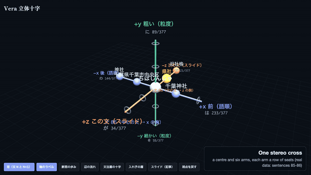
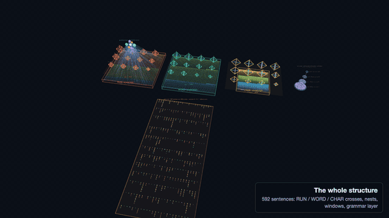

# Vera (line 3) — a deterministic Japanese question-answering structure with no training

Vera is a weekend-scale research project: can a structure built **only from the sentences of a corpus** — no neural network, no embeddings, no weights, no random numbers — answer questions about that corpus, show where every candidate came from, and stay silent when it has no evidence?

The short answer today: **it answers fewer questions than a simple keyword search, it never answers with confidence when it is wrong, and every number below is reproducible byte for byte.** This README states what has been measured, what has not, and how to rerun it.

(日本語: 設計上の判断はすべて `ops/decisions/` に逐語で、実装上の判断は `docs/LINE3_LOCAL_DECISIONS.md` に番号付きで記録しています。)

## What it is

- Each sentence of the corpus is cut into units at three granularities (RUN / WORD / CHAR) and placed on a **stereo cross** (an orthoplex: a centre and six arms, ±x ±y ±z, each arm a row of seats).
- Placement is exact: the stability of a cross is a rational number (Python `Fraction`), the moves are the 24 rotations of the cube and seat swaps, and placement stops at a fixed point.
- A question is placed the same way; a candidate is accepted only when three independent ratios (section walk, edge flow, placement binding) agree. Otherwise the output is a **typed abstention** (`CHOICE` = a list the user can reject, `UNKNOWN_*` = no candidate).
- Every candidate carries its **provenance**: a corpus record, a testimony, or a constructed unit, down to the sentence ids.
- Sliding windows read two neighbouring sentences of one article; layers pack unstable crosses into a larger cross; the **combined list** shows the flat read, the layers and the windows as separately labelled blocks (nothing is merged across sources).
- Same corpus + same question ⇒ the same bytes on an M-series Mac, an Intel Mac and an x86 Linux CI runner (`tools/determinism_probe.py`, `PYTHONHASHSEED` 0 / 1 / 12345).

3D views (three.js):

- one stereo cross, with its arms and seats: <https://claude.ai/artifact/CqAGojmogqLyhSDBU3Dozb>
- the whole structure built from the 592-sentence corpus — the three sovereigns, the layer-1 nests, the sliding windows, the grammar layer and the carry tower (exported with `tools/export_structure_json.py`, see `docs/LINE3_STRUCTURE_OVERVIEW.md`): <https://claude.ai/artifact/BZEvuMkGYR7UhG7AUymPh2>





The single-cross page is `docs/media/stereo_cross_v1.html`; the overview page is built by `tools/build_structure_overview.py`. The recordings are made by `tools/record_structure_video.js` (headless Chrome + ffmpeg; see its header).

## Measured numbers (all with denominators)

Corpus `fulllead`: 592 lead sentences of Japanese Wikipedia articles. Question bank `bank2`: 128 items written by a separate system that never saw Vera's code (`experiments/line3/bank2/`); 69 are answerable from the corpus, 25 are deliberately unanswerable. Baselines: B1 = keyword lookup of one sentence; B2 = keyword lookup plus the next sentence. "Gold in a candidate" = the correct answer appears in at least one entry of the list.

| system (fulllead, bank2) | answerable 69: gold in a candidate | single answer, wrong | unanswerable 25: confident wrong answer |
|---|---|---|---|
| **Vera combined list (standard)** | **32 / 69** | 0 | **0 / 25** |
| Vera flat cross only | 19 / 69 | 1 | 0 / 25 |
| B1 keyword search | 47 / 69 | — | 14 / 25 |
| B2 keyword + next sentence | 57 / 69 | — | 7 / 25 |

Source: `experiments/line3/g3/combined/results/ci/standard_live_run37928419541.md` (run on GitHub Actions) and `experiments/line3/t10/results/summary.md`.

Vera's lists are long: the median combined list has about 70 entries. Vera is **not** better than search at finding the answer; it is better than search at not inventing one.

`bank3`, 91 questions of kinds the system was never tuned on (`experiments/line3/t11/results/summary.md`, fast preset):

| kind | n | Vera gold in a candidate | B2 keyword |
|---|---|---|---|
| two facts across sentences | 14 | 4 | 8 |
| paraphrase | 20 | 3 | 12 |
| unknown (altered) word | 18 | 6 | 16 |
| summary choice | 10 | 1 | (lookup 9) |

A 3,000-sentence corpus (`S3000`), flat read, fast preset, on a 4-core CI runner: cross-sentence 1 / 9, unanswerable 25: 5 abstained, 18 lists, 2 confident wrong; median 221 s per question (`experiments/line3/t10/results/ci/`).

## What it does not do

- It does not beat keyword search (32 vs 57 of 69).
- It does not handle paraphrase or unknown words well (3 / 20, 6 / 18).
- It is slow: minutes per question; a 3,000-sentence corpus takes about 3 hours to place on a 4-core runner.
- It does not generate text. Answers are units of the corpus (an "assembled" block joins spans for display only and is never counted).
- It has not been shown to **grow**: every measurement so far places the whole corpus at once. Growing by stacking documents onto a thin initial placement is the project's thesis and is unmeasured.
- Japanese only (MeCab via `fugashi` + `unidic-lite` for the WORD tier).

## Try it

```bash
pip install -e ".[ja]"
export PYTHONHASHSEED=0 PYTHONPATH=.
```

Build the placement caches for the 300-sentence sample corpus, then ask (`--data` is a jsonl of `{"sent": ..., "source": ...}` lines):

```bash
python -m verantyx.cli line3 build --data experiments/line3/data/S300.jsonl --cache /tmp/vera-s300 --structure flat --workers 2
```

```bash
python -m verantyx.cli line3 ask --data experiments/line3/data/S300.jsonl --cache /tmp/vera-s300 --structure flat --effort fast --question "遊眠は日本の何ですか"
```

What to expect from the sample: `S300` is one lead sentence from each of 300 different pages, so the sliding windows (`--structure combined`) do not apply to it — they need articles (`source` of the form `title#i`, as in `experiments/line3/bank2/data/fulllead_sents.jsonl`). Placing the three tiers of `S300` took 22 minutes with two workers on an M-series laptop. At `--effort fast` the reader looks at a handful of crosses per tier and reports how many it left unread (the `部分読み` line), so most questions end in a labelled list or a typed abstention; the numbers in the tables above come from `fulllead` at the `standard` preset.

`--format json` prints the full record (candidates with provenance, the three ratios, the abstention type, the read order). `--show-thought` prints the trace. Placing a corpus is the slow part; it is cached per tier.

Tests (about a thousand, including golden outputs that pin the bytes):

```bash
python -m pytest tests/line3 -q
```

Sweeps run on GitHub Actions (`.github/workflows/line3-sweep.yml`): probe → per-tier caches → N shards → summary; the result files above were produced there.

## How the project is run

- The owner decides every meaning-level question personally; each decision is recorded verbatim in `ops/decisions/2026-10-06_line3_faithful_build.md`.
- Implementation choices are numbered (`L-nnn`) and appended to `docs/LINE3_LOCAL_DECISIONS.md`; design notes are in `docs/LINE3_*.md`.
- Question banks are written by a separate model that does not see the code; their hashes are recorded at intake. Negative results are kept in the same tables as positive ones.
- Code is written by AI agents under review; the owner's original algorithm is the specification.

## Repository map

| path | what |
|---|---|
| `verantyx/line3/` | placement, ask, cycle, layers (matryoshka), carry, granularity, grammar, sliding windows, combined list |
| `verantyx/cli.py` | `line3 build` / `line3 ask` |
| `tests/line3/` | unit tests and golden outputs |
| `experiments/line3/` | every measurement with its raw records and summaries (t8 … t11, bank2, bank3, g2, g3) |
| `docs/LINE3_*.md` | design documents and the numbered local decisions |
| `ops/decisions/` | the owner's decisions, verbatim |
| `tools/` | determinism probe, CI summariser, remote helpers |

Older material in this repository (the pre-line-3 alpha, `docs/README_alpha_dev.md`, `public_overlay/`) describes earlier systems and is kept for the record.

## License

MIT (see `LICENSE`).

---

The English in this README was written with the help of an AI.
